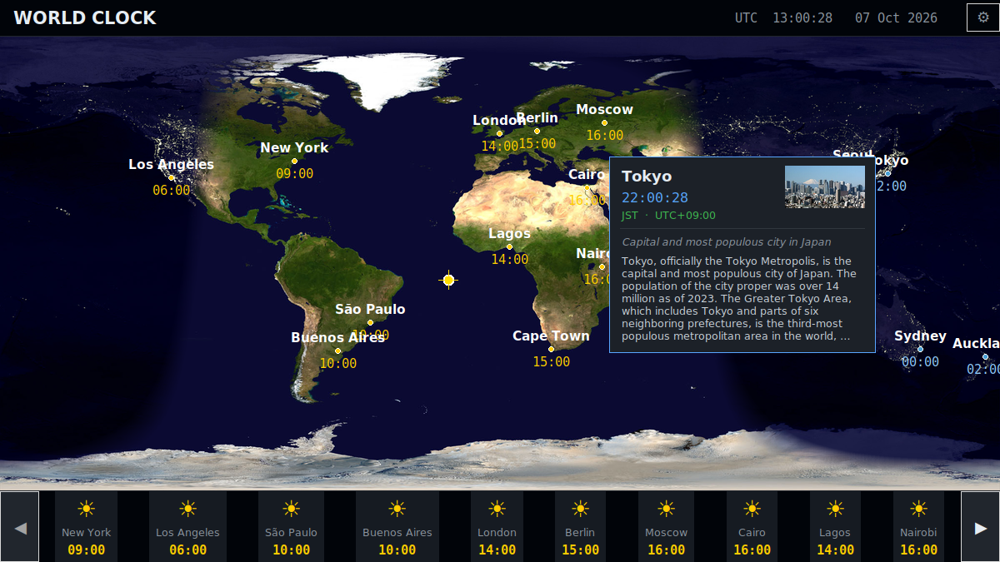

# World Clock

A Geochron-style desktop world clock. It shows a world map with a live day/night blend, city lights on the night side, and the local time for 20 cities.



## Features

- Day/night terminator with a soft civil-twilight fade, updated every minute
- NASA Blue Marble map by day, NASA Earth at Night city lights by night
- Sun marker at the point where the sun is directly overhead
- City dots with local time, coloured by day or night
- Click a city dot for a flyout with a Wikipedia summary and photo
- Optional bottom strip of city tiles (turn it on with the ⚙ button)

## Requirements

- Linux with an X11 display (Wayland works through XWayland)
- Docker
- `make` and `xhost`

Nothing else is installed on the host. The app runs inside a Docker container and draws its window on your display.

## Usage

```bash
make run     # build the image and launch the app
make build   # build the image only
make shell   # open a shell inside the container
```

The first build downloads the map images from NASA, so it takes a few minutes. Later runs start in seconds.

`make run` calls `xhost +local:docker` so the container can open a window on your display.

## Development

All code is in `world_clock.py`. It uses only the Python standard library, tkinter and Pillow.

To iterate, run `make shell`, then inside the container:

```bash
python3 /workspace/world_clock.py
```

Edit the file on the host and restart the process to see changes.

## Adding cities

Edit the `CITIES` list at the top of `world_clock.py`:

```python
("City Name", "Continent/Timezone", latitude, longitude),
```

The timezone must be a valid IANA name, such as `Europe/London`. If the city's Wikipedia article title differs from its display name, add it to `_WIKI_TITLES`.

## Credits

Map imagery from NASA Visible Earth: Blue Marble and Earth at Night.

## License

MIT. See [LICENSE](LICENSE).
